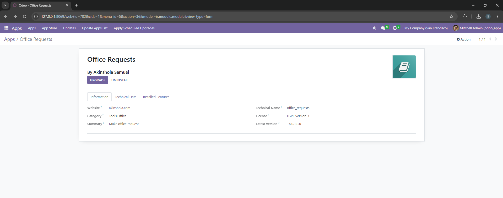
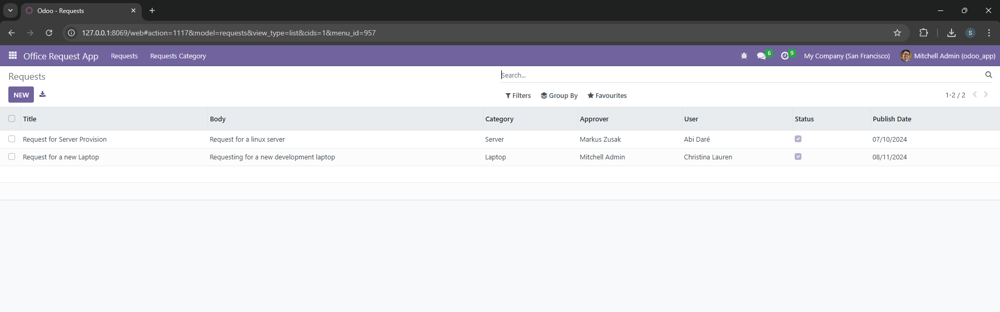
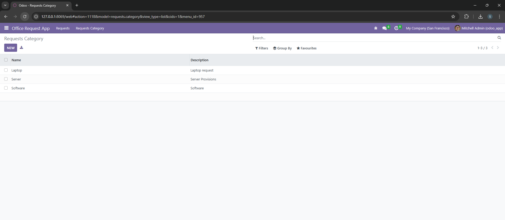
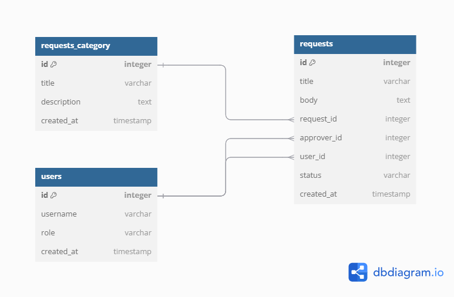

# InterPulse ~ Master Class ~ Simple Odoo Request App



## Summary

A simple request management app with the following sub-modules, 
developed in a live master class coding session at InternPulse.
    - Manage Office Requests
    - Manage Request Category





## Database Architecture 
[Link <> Data Structure](https://dbdiagram.io/d/Odoo-ERP-lessgreater-internPulse-672247312c337ee119e77bcb)



## Logic

...

## Project Structure

```
office_requests/
    __init__.py
    __manifest__.py
    data/
        __init__.py
        data.xml
    models/
        __init__.py
        models.py
    security/
        __init__.py
        security.xml
    views/
        __init__.py
        views.xml
        actions.xml
    menus/
        __init__.py
        menus.xml
    static/
        description/
            icon.png
```
